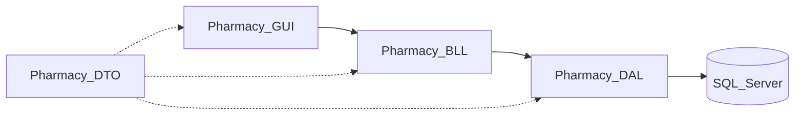

# PharmacyManagement — Ngữ cảnh dự án (ưu tiên đọc trước)

Tài liệu này là **nguồn tham chiếu chính** cho kiến trúc mục tiêu, nghiệp vụ, giao diện, phân quyền và quy trình phát triển. Mọi thay đổi chức năng, refactor hoặc sửa lỗi cần **đối chiếu với file này trước**; nếu quyết định kỹ thuật lệch khỏi nội dung dưới đây, phải **cập nhật lại tài liệu này** trong cùng nhánh/commit.

---

## Tên Phần mềm: Pharmacy Management ALN

## 1. Trạng thái triển khai trong repo

- **Hiện tại**: solution `PharmacyManagement.slnx` gồm project WinForms `PharmacyManagement` và các class library **`Pharmacy.Common`**, **`Pharmacy.DTO`**, **`Pharmacy.DAL`**, **`Pharmacy.BLL`** (ADO.NET + stored procedure `sp_DangNhap`, `sp_NhapKho`, `sp_BanThuoc`; đọc view báo cáo trong `SQL/View_PharmacyManagement.sql`). Project **`Pharmacy.GUI`** chưa tách — form vẫn nằm trong `PharmacyManagement/` (đã có màn đăng nhập `Forms/Auth/FrmLogin.cs` gọi `AuthService`; sau đăng nhập thành công `Program` mở **`Forms/Main/FrmDashboard.cs`** — shell dashboard tổng quan: KPI / biểu đồ cột doanh thu tuần / biểu đồ tròn trạng thái hóa đơn / lưới hóa đơn gần đây / cảnh báo lấy từ **`ReportService.LayDashboardHienThi()`** (BLL → DAL); hover cột và lát bánh làm nổi bật và hiển thị tooltip chi tiết; **Nhân viên kho** chỉ thấy chỉ số tồn + cảnh báo (doanh thu/hóa đơn ẩn theo vai trò). Menu trái ẩn theo `UserSession.TenVaiTro`, avatar chữ theo `Helpers/UserDisplayHelper.cs`; `Form1` giữ làm form placeholder khi cần thử nhanh).
- **Mục tiêu**: tách `Pharmacy.GUI` khi ổn định form/module; mọi code presentation mới ưu tiên gọi **BLL**, không ghi SQL trực tiếp trong form.

**Framework**: `.csproj` có thể khai báo `TargetFramework` khác bảng “đề xuất” (ví dụ `net10.0-windows`). Khi đổi phiên bản .NET, cập nhật dòng tương ứng trong mục 3 và ghi chú tại đây.

---

## 2. Cấu trúc thư mục chuẩn (mục tiêu)

```
PharmacyManagement
│
├── Pharmacy.GUI
│   ├── Forms
│   │   ├── Auth
│   │   │   ├── FrmLogin.cs
│   │   ├── Main
│   │   │   ├── FrmDashboard.cs
│   │   │   ├── FrmMain.cs
│   │   ├── Medicine
│   │   │   ├── FrmThuoc.cs
│   │   │   ├── FrmNhomThuoc.cs
│   │   ├── Inventory
│   │   │   ├── FrmNhapKho.cs
│   │   │   ├── FrmTonKho.cs
│   │   ├── Sales
│   │   │   ├── FrmBanHang.cs
│   │   │   ├── FrmHoaDon.cs
│   │   │   ├── FrmChiTietHoaDon.cs
│   │   ├── Alert
│   │   │   ├── FrmCanhBaoHetHan.cs
│   │   ├── Report
│   │   │   ├── FrmBaoCaoDoanhThu.cs
│   │   └── Admin
│   │       ├── FrmNhanVien.cs
│   │       └── FrmAuditLog.cs
│
├── Pharmacy.BLL
│   ├── AuthService.cs
│   ├── MedicineService.cs
│   ├── InventoryService.cs
│   ├── SalesService.cs
│   ├── ReportService.cs
│   ├── AuditService.cs
│   └── NhanVienAdminService.cs
│
├── Pharmacy.DAL
│   ├── DbContextDAL.cs
│   ├── NhanVienRepositoryDAL.cs
│   ├── ThuocRepositoryDAL.cs
│   ├── PhieuNhapRepositoryDAL.cs
│   ├── HoaDonRepositoryDAL.cs
│   ├── ReportRepositoryDAL.cs
│   └── AuditRepositoryDAL.cs
│
├── Pharmacy.DTO
│   ├── NhanVienDTO.cs
│   ├── ThuocDTO.cs
│   ├── NhomThuocDTO.cs
│   ├── PhieuNhapDTO.cs
│   ├── HoaDonDTO.cs
│   ├── ChiTietHoaDonDTO.cs
│   └── AuditLogDTO.cs
│
├── Pharmacy.Common
│   ├── UserSession.cs
│   ├── PasswordHelper.cs
│   ├── Validator.cs
│   └── Logger.cs
│
└── SQL
    ├── PharmacyManagement.sql
    ├── Trigger_PharmacyManagemnt.sql
    └── View_PharmacyManagement.sql
```

---

## 3. Công nghệ cốt lõi

| Thành phần | Công nghệ đề xuất |
|------------|-------------------|
| Giao diện | C# WinForms |
| Backend nghiệp vụ | C# .NET Framework hoặc .NET 6+ Windows Desktop (runtime thực tế lấy từ `.csproj`) |
| Cơ sở dữ liệu | SQL Server |
| Kết nối CSDL | ADO.NET (`Microsoft.Data.SqlClient` trong `Pharmacy.DAL`) hoặc Entity Framework |
| Cấu hình chuỗi kết nối WinForms | File `PharmacyManagement/appsettings.json` (copy cùng exe): `ConnectionStrings:PharmacyManagement`; `Program` gọi `ConnectionSettings.ApplyFromJsonFile()` trước khi mở đăng nhập. Mặc định code: `DbContextDAL.DefaultConnectionString` (LocalDB). |
| Báo cáo | Microsoft ReportViewer / RDLC |
| Xuất Excel | ClosedXML / EPPlus |
| Logging | Serilog / NLog |
| Mật khẩu | BCrypt.Net (`BCrypt.Net-Next` trong `Pharmacy.Common`) |
| Sao lưu | SQL Server Backup Script |
| In hóa đơn | Crystal Report / RDLC / PrintDocument |
| Biểu đồ doanh thu | Chart Control WinForms |

**Quy ước**: không thêm thư viện ngoài bảng trên (hoặc ngoài stack đã thống nhất trong team) mà không cập nhật mục này và không ghi rõ lý do trong PR/commit.

**Lỗi đăng nhập / SQL**: thông báo kiểu «Cannot open database 'PharmacyManagement'» nghĩa là trên instance SQL trong chuỗi kết nối **chưa có** database đó (hoặc sai server). Chạy `SQL/PharmacyManagement.sql` trên đúng instance (ví dụ SSMS kết nối `(localdb)\mssqllocaldb` nếu dùng mặc định), hoặc chỉnh `appsettings.json` trỏ tới SQL Server đã tạo CSDL. Form đăng nhập bắt `SqlException` và hiển thị gợi ý tương ứng.

**Tiếng Việt / Unicode**: script SQL và CSDL nên UTF-8 (có BOM khi cần). `Pharmacy.Common/UnicodeTextHelper` và DAL so khớp thêm alias trạng thái **Hoàn thành** xử lý dữ liệu cũ bị mojibake; `Program` đặt `CultureInfo` mặc định `vi-VN` cho định dạng tiền tệ trên dashboard.

---

## 4. Giao diện WinForms

### Tông màu

| Thành phần | Mã màu |
|------------|--------|
| Màu chính (xanh dược) | `#2E7D32` |
| Màu phụ (xanh nhạt) | `#E8F5E9` |
| Cảnh báo gần hết hạn | `#FB8C00` |
| Thuốc hết hạn | `#D32F2F` |
| Nền | Trắng / xám nhạt |
| Text chính | Đen / xám đậm |

### Font và cỡ chữ

- Font chính: **Segoe UI**
- Form: 10–11 pt
- Tiêu đề: 14–18 pt, **bold**
- Nút (Button): 10–11 pt, **semi-bold** nhẹ

---

## 5. Bố cục UX và ánh xạ menu

- **Bố cục**: menu **bên trái**, vùng **nội dung bên phải** (main shell, ví dụ `FrmMain`).
- **Mục menu đề xuất**: Dashboard · Bán hàng · Nhập kho · Kiểm kê · Thuốc · Khách hàng · Báo cáo · Người dùng.

### Ánh xạ tới form đã đặt tên trong cấu trúc chuẩn

| Mục menu | Form / module (chuẩn) | Ghi chú |
|----------|------------------------|---------|
| Bán hàng | `Forms/Sales/FrmBanHang.cs` | Kèm hóa đơn: `FrmHoaDon`, `FrmChiTietHoaDon` |
| Nhập kho | `Forms/Inventory/FrmNhapKho.cs` | |
| Tồn kho / kiểm tra tồn | `Forms/Inventory/FrmTonKho.cs` | Có thể dùng làm bước đầu cho “Kiểm kê” |
| Thuốc | `FrmThuoc.cs`, `FrmNhomThuoc.cs` | |
| Cảnh báo / hết hạn | `Forms/Alert/FrmCanhBaoHetHan.cs` | |
| Báo cáo | `Forms/Report/FrmBaoCaoDoanhThu.cs` | |
| Người dùng / nhân sự | `Forms/Admin/FrmNhanVien.cs` | |
| Audit | `Forms/Admin/FrmAuditLog.cs` | |
| Đăng nhập | `Forms/Auth/FrmLogin.cs` | |
| Dashboard (shell) | `Forms/Main/FrmDashboard.cs` | Sau đăng nhập; menu ẩn theo `UserSession` |

### TODO kiến trúc (chưa có tên form cố định trong cây chuẩn)

Các mục menu sau **chưa** được gán class trong cấu trúc thư mục chuẩn — khi triển khai, đặt tên form và cập nhật bảng trên; **không** bịa tên class trong agent mà chưa có trong repo hoặc trong tài liệu này:

- **Kiểm kê** (nếu tách khỏi tồn kho / điều chỉnh kiểm kê)
- **Khách hàng**

---

## 6. Kiến trúc tầng

- **Presentation**: `Pharmacy.GUI` — WinForms, binding sự kiện, điều hướng, **không** chứa SQL trực tiếp.
- **Business**: `Pharmacy.BLL` — luật nghiệp vụ, transaction điều phối, kiểm tra quyền (khuyến nghị).
- **Data access**: `Pharmacy.DAL` — kết nối SQL Server, query/command, transaction ở lớp dữ liệu khi phù hợp.
- **DTO**: `Pharmacy.DTO` — cấu trúc dữ liệu qua tầng; **không** chứa logic nghiệp vụ.
- **Common**: tiện ích dùng chung (`UserSession`, mật khẩu, validate, log).
- **Database**: script schema/trigger/view trong thư mục `SQL/` ở gốc workspace.



---

## 7. Nghiệp vụ then chốt

- **Bán hàng**: hóa đơn, chi tiết, tồn kho real-time hoặc theo batch tùy thiết kế; nhất quán số lượng và giá.
- **Nhập kho**: phiếu nhập, cập nhật tồn, lô / hạn dùng nếu có.
- **FEFO**: xuất kho ưu tiên theo nguyên tắc **First Expired, First Out** khi có nhiều lô.
- **Kiểm kê**: đối soát tồn thực tế và sổ sách (form/module TODO nếu chưa có).
- **Cảnh báo hết hạn**: tách UI cảnh báo (màu cam/đỏ theo mục 4).
- **Audit**: ghi nhận thao tác nhạy cảm (xóa/sửa giá/số lượng quan trọng, phân quyền) theo `AuditService` / `FrmAuditLog`.

---

## 8. Phân quyền cơ bản

**Vai trò**: Admin · Quản lý · Dược sĩ · Nhân viên kho.

| Chức năng | Admin | Quản lý | Dược sĩ | Kho |
|-----------|:-----:|:-------:|:-------:|:---:|
| Bán thuốc | Có | Có | Có | Không |
| Nhập kho | Có | Có | Không | Có |
| Quản lý thuốc | Có | Có | Xem | Có |
| Báo cáo | Có | Có | Không | Không |
| Nhân viên | Có | Không | Không | Không |
| Audit Log | Có | Có | Không | Không |

**Khuyến nghị triển khai**

- Kiểm tra quyền ở **BLL** (và tái kiểm ở DAL nếu cần an toàn sâu); GUI **ẩn / vô hiệu hóa** menu theo `UserSession` (hoặc enum role tương đương).
- Không dựa hoàn toàn vào “ẩn nút” — luôn từ chối thao tác trái quyền ở tầng nghiệp vụ.

---

## 9. Quy tắc làm việc cho developer / agent

1. Đọc **toàn bộ** các mục liên quan trong `project_Context.md` trước khi sửa code.
2. Nếu thay đổi schema: cập nhật `SQL/*.sql` trước hoặc đồng bộ với migration nội bộ của team.
3. Thứ tự chỉnh sửa gợi ý: **Context** → **DTO** (nếu đổi hợp đồng dữ liệu) → **DAL** → **BLL** → **GUI**.
4. Giao dịch **nhập/bán/điều chỉnh tồn**: dùng transaction (BLL điều phối hoặc DAL tùy chuẩn đội) để tránh lệch tồn.
5. Thao tác nhạy cảm: ghi **audit** theo quy ước dự án.
6. UI mới: tuân màu/font/bố cục mục 4–5.
7. Không thêm package mới mà không cập nhật mục 3 (và changelog/PR).

---

## 10. Cập nhật tài liệu

Mọi thay đổi đáng kể về cấu trúc thư mục, menu, phân quyền, stack hoặc quy trình nghiệp vụ phải được phản ánh trong **chính file này** cùng với thay đổi code.

---

*Phiên bản tài liệu: 1.0 — đồng bộ với kế hoạch `project_Context.md` (ngữ cảnh ưu tiên nghiệp vụ).*
