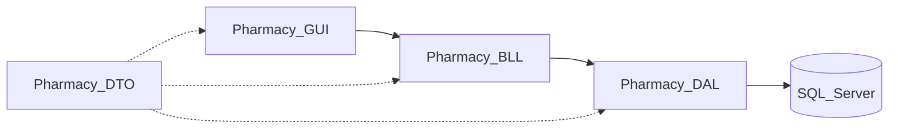

# PharmacyManagement — Ngữ cảnh dự án (ưu tiên đọc trước)

Tài liệu này là **nguồn tham chiếu chính** cho **nghiệp vụ**, **công nghệ**, **menu & giao diện**, **cấu trúc thư mục chuẩn**, **tích hợp ngoài**, **bảo mật**, **kiến trúc tầng** và **phân quyền**. **Luồng hoạt động từng bước** (FEFO, DQG, transaction nhập kho, kê đơn…) nằm trong **`project_Workflow.md`**.

Mọi thay đổi chức năng, refactor hoặc sửa lỗi cần **đối chiếu với các tài liệu này**; nếu quyết định kỹ thuật lệch khỏi nội dung, phải **cập nhật lại đúng file** trong cùng nhánh/commit.

---

## Tên đề tài & phần mềm

- **Đề tài**: Quản lý nhà thuốc — **bán thuốc theo toa**.
- **Tên phần mềm (branding)**: **Pharmacy Management ALN**.

---

## 1. Trạng thái triển khai trong repo

- **Hiện tại**: solution `PharmacyManagement.slnx` gồm project WinForms `PharmacyManagement` và các class library **`Pharmacy.Common`**, **`Pharmacy.DTO`**, **`Pharmacy.DAL`**, **`Pharmacy.BLL`** (ADO.NET + stored procedure `sp_DangNhap`, `sp_NhapKho`, `sp_BanThuoc`; đọc view báo cáo trong `SQL/View_PharmacyManagement.sql`). CSDL: **`KhachHang(CCCD)`** là PRIMARY KEY; **`HoaDon.CCCD`** FK (nullable = khách lẻ); trigger `trg_HoaDon_KiemTraCCCD`; view `vw_HoaDon_ThongTinKhachHang`, `vw_LichSuMuaHangTheoCCCD`. Project **`Pharmacy.GUI`** chưa tách — form vẫn nằm trong `PharmacyManagement/` (màn đăng nhập `Forms/Auth/FrmLogin.cs` gọi `AuthService`; sau đăng nhập thành công `Program` mở **`Forms/Main/FrmMain.cs`** — sidebar + header + vùng nội dung; mục **Dashboard** nhúng **`Forms/Main/FrmDashboard.cs`** — KPI / biểu đồ cột doanh thu tuần / biểu đồ tròn trạng thái hóa đơn / lưới hóa đơn gần đây / cảnh báo qua **`ReportService.LayDashboardHienThi()`** (BLL → DAL); mục **Kê đơn bán thuốc** nhúng **`Forms/Sales/FrmKeDonBanThuoc.cs`** — tra cứu CCCD, điền đủ họ tên/SĐT/địa chỉ/ngày sinh, «Lưu KH mới» (`KhachHangService`), lịch sử mua, bán qua `SalesService`/`sp_BanThuoc`; in phiếu nháp (`PrintDocument`), xuất phiếu nháp Excel (`ClosedXML`, `.xlsx`); sau «Xác nhận bán» hiển thị hóa đơn định dạng trong cửa sổ xem; hover cột và lát bánh + tooltip; **nhân viên kho** chỉ thấy chỉ số tồn + cảnh báo khi được mở rộng dashboard). Mục **Thêm hàng hóa** nhúng **`Forms/Product/FrmThemHangHoa.cs`** — 3 tab (Thông tin chung / Thuộc tính & giá / Đơn vị – DQG) bố cục bằng `TableLayoutPanel` co giãn theo bề ngang, header có 3 chip-badge trạng thái (DQG · Biên LN · HSD) cập nhật realtime, panel cuộn cho từng tab; tra cứu **`vw_TraCuuDanhMucDQG`** qua `MedicineService.TraCuuDQG`, áp dụng dòng DQG để tự điền hoạt chất / hàm lượng / đóng gói; lưu qua `MedicineService.ThemThuoc` (BLL kiểm tra trùng tên / trùng DQG, biên giá, HSD). Mục **Báo cáo** mở **`Forms/Report/FrmBaoCao.cs`** (landing 4 KPI: tồn thấp / sắp hết hạn / hóa đơn hôm nay / doanh thu hôm nay từ `ReportService.LayDashboardTongQuan` + 2 thẻ điều hướng có chip nhãn màu), tiếp **`Forms/Report/FrmCanhBaoThuoc.cs`** (3 tab Tồn thấp / Sắp hết hạn / Đã hết hạn — KPI card, ô tìm kiếm nhanh, badge trạng thái nền màu, zebra rows, nút Xuất CSV theo tab) và **`Forms/Report/FrmBaoCaoThuoc.cs`** (4 tab Danh mục / Tồn kho / Bán chạy / Lịch sử nhập-bán — KPI mini cập nhật theo tab, badge trạng thái, huy hiệu top 1-2-3 bán chạy, lọc client-side cho mọi tab, xuất CSV). Menu trái ẩn theo `UserSession.TenVaiTro`, avatar chữ theo `Helpers/UserDisplayHelper.cs`; `Form1` giữ placeholder thử nhanh.

- **Mục tiêu UX/menu**: shell chính **`Forms/Main/FrmMain.cs`** — sidebar trái theo **mục 2** dưới đây; nội dung phải theo bảng ánh xạ **mục 2.2**. Tách `Pharmacy.GUI` khi ổn định; code presentation mới **chỉ** gọi **BLL**, không ghi SQL trong form.

**Framework**: `.csproj` có thể khai báo `TargetFramework` khác bảng công nghệ (ví dụ `net10.0-windows`). Khi đổi phiên bản .NET, cập nhật **mục 4** và ghi chú tại đây.

---

## 2. Menu sidebar (đề tài) & ánh xạ form

### 2.1. Cây menu

1. **Dashboard** — Admin  
2. **Quản lý kho** — Admin, Kho  
   - Thông tin phiếu nhập kho  
   - Danh sách hàng nhập kho  
   - Quản lý thuốc (tra cứu / sửa / ngừng bán — không thêm mới; thêm qua **Thêm hàng hóa**)  
3. **Thêm hàng hóa** — Admin, Kho  
   - Tab: Thông tin chung · Thuộc tính · Đơn vị  
4. **Kê đơn bán thuốc** — Dược sĩ  
5. **Quản lý doanh thu** — Admin  
6. **Quản lý nhân viên** — Admin  
7. **Báo cáo** — theo mục con  
   - Cảnh báo thuốc hết hàng / hết hạn — Admin, Kho, Dược sĩ  
   - Báo cáo thuốc — Admin  
8. **Audit log** — Admin  

*(Đăng nhập và shell không nằm trong cây menu đề tài nhưng là cổng vào ứng dụng — xem bảng dưới.)*

### 2.2. Ánh xạ menu → form / module (đường dẫn chuẩn trong `Pharmacy.GUI` hoặc project WinForms hiện tại)

| Thứ tự / mục | Form / module (chuẩn) | Quyền | Ghi chú |
|--------------|------------------------|--------|---------|
| — | `Forms/Auth/FrmLogin.cs` | Tất cả | Trước shell |
| — | `Forms/Main/FrmMain.cs` | Theo quyền | Sidebar + panel nội dung |
| **1** | `Forms/Main/FrmDashboard.cs` | Admin | Tổng quan KPI & biểu đồ (Kho không dùng mục này theo ma trận mục 10) |
| **2** (mẹ) | `Forms/Inventory/FrmQuanLyKho.cs` | Admin, Kho | Host hoặc điều hướng tới 2a / 2b |
| **2a** | `Forms/Inventory/FrmThongTinPhieuNhapKho.cs` | Admin, Kho | Lập chứng từ `PhieuNhapKho` (chưa cộng tồn) |
| **2b** | `Forms/Inventory/FrmDanhSachHangNhapKho.cs` | Admin, Kho | `ChiTietPhieuNhap`, DQG, lưới dòng |
| **2c** | `Forms/Inventory/FrmQuanLyThuoc.cs` | Admin, Kho | Tra cứu / sửa / ngừng bán (`MedicineService`); không thêm — dùng **3** |
| **3** | `Forms/Product/FrmThemHangHoa.cs` | Admin, Kho | Tab: Thông tin chung / Thuộc tính / Đơn vị — **cổng thêm thuốc mới** |
| **4** | `Forms/Sales/FrmKeDonBanThuoc.cs` | Dược sĩ | Kê đơn theo CCCD (tra cứu / thêm khách / lịch sử mua), bán qua `sp_BanThuoc` — FEFO theo trigger lô |
| **5** | `Forms/Finance/FrmQuanLyDoanhThu.cs` | Admin | Doanh thu / hóa đơn / lợi nhuận theo thiết kế |
| **6** | `Forms/Admin/FrmNhanVien.cs` | Admin | CRUD nhân viên, tài khoản, phân quyền |
| **7** (mẹ) | `Forms/Report/FrmBaoCao.cs` | Theo mục con | Host hoặc điều hướng 7a / 7b |
| **7a** | `Forms/Report/FrmCanhBaoThuoc.cs` | Admin, Kho, Dược sĩ | Tồn thấp, sắp hết hạn, đã hết hạn |
| **7b** | `Forms/Report/FrmBaoCaoThuoc.cs` | Admin | Danh mục, tồn, bán chạy/chậm… |
| **8** | `Forms/Admin/FrmAuditLog.cs` | Admin | `AuditService` / lịch sử thao tác |

### 2.3. TODO form (chưa gán cố định trong repo)

Khi triển khai, đặt tên class và cập nhật bảng **2.2** — không bịa tên chưa tồn tại:

- **Kiểm kê** / điều chỉnh tồn (nếu tách khỏi nhập kho)
- **Hồ sơ bệnh nhân** đầy đủ (dị ứng, tiền sử, toa điện tử) — mở rộng sau đề tài; master `KhachHang` + menu CRUD riêng chưa bắt buộc (thêm khách nhẹ trên form kê đơn)

---

## 3. Giao diện WinForms

### 3.1. Bố cục & điều hướng

- **Shell**: sidebar **trái**, nội dung **phải** trong `FrmMain`.
- **Điều hướng**: ẩn/hiện mục menu theo `UserSession.TenVaiTro`; BLL **luôn** từ chối thao tác trái quyền.
- **Dashboard**: Admin xem đầy đủ KPI và doanh thu; nếu sau này Kho được vào dashboard rút gọn, chỉ hiển thị tồn + cảnh báo (không hiển thị doanh thu/hóa đơn chi tiết).

### 3.2. Tông màu

| Thành phần | Mã màu |
|------------|--------|
| Màu chính (xanh dược) | `#2E7D32` |
| Màu phụ (xanh nhạt) | `#E8F5E9` |
| Cảnh báo gần hết hạn | `#FB8C00` |
| Thuốc hết hạn | `#D32F2F` |
| Nền | Trắng / xám nhạt |
| Text chính | Đen / xám đậm |

### 3.3. Font

- Font chính: **Segoe UI**
- Form: 10–11 pt; tiêu đề: 14–18 pt **bold**; nút: 10–11 pt semi-bold nhẹ.

---

## 4. Cấu trúc thư mục chuẩn (khớp menu mục 2.1)

Cây dưới đây **ánh xạ 1:1** thứ tự chức năng menu (1→8) vào thư mục `Forms/` (cùng với Auth + shell). Một số file có thể chưa tồn tại — khi tạo mới, đặt đúng đường dẫn và cập nhật bảng **2.2**.

```
PharmacyManagement
│
├── Pharmacy.GUI                         ← mục tiêu tách; hiện có thể gộp trong PharmacyManagement/
│   ├── Forms
│   │   ├── Auth                         ← trước shell (đăng nhập)
│   │   │   └── FrmLogin.cs
│   │   ├── Main                         ← shell + (1) Dashboard
│   │   │   ├── FrmMain.cs              ← sidebar + panel nội dung
│   │   │   └── FrmDashboard.cs         ← 1. Dashboard
│   │   ├── Inventory                    ← 2. Quản lý kho
│   │   │   ├── FrmQuanLyKho.cs         ← 2 — menu mẹ / host
│   │   │   ├── FrmThongTinPhieuNhapKho.cs   ← 2a. Thông tin phiếu nhập kho
│   │   │   ├── FrmDanhSachHangNhapKho.cs    ← 2b. Danh sách hàng nhập kho
│   │   │   ├── FrmQuanLyThuoc.cs            ← 2c. Quản lý thuốc (không thêm mới)
│   │   │   └── FrmSuaThuoc.cs               ← dialog sửa thuốc (từ 2c)
│   │   ├── Product                      ← 3. Thêm hàng hóa
│   │   │   └── FrmThemHangHoa.cs       ← tab: Thông tin chung / Thuộc tính / Đơn vị
│   │   ├── Sales                        ← 4. Kê đơn bán thuốc
│   │   │   └── FrmKeDonBanThuoc.cs
│   │   ├── Finance                      ← 5. Quản lý doanh thu
│   │   │   └── FrmQuanLyDoanhThu.cs
│   │   ├── Admin                        ← 6. Quản lý nhân viên | 8. Audit log
│   │   │   ├── FrmNhanVien.cs
│   │   │   └── FrmAuditLog.cs
│   │   └── Report                       ← 7. Báo cáo
│   │       ├── FrmBaoCao.cs            ← 7 — menu mẹ / host
│   │       ├── FrmCanhBaoThuoc.cs      ← 7a. Cảnh báo hết hàng / hết hạn
│   │       └── FrmBaoCaoThuoc.cs       ← 7b. Báo cáo thuốc
│   │
│   └── (Resources, v.v. theo nhu cầu project)
│
├── Pharmacy.BLL
│   ├── AuthService.cs
│   ├── MedicineService.cs
│   ├── InventoryService.cs
│   ├── SalesService.cs
│   ├── KhachHangService.cs
│   ├── ReportService.cs
│   ├── AuditService.cs
│   └── NhanVienAdminService.cs
│
├── Pharmacy.DAL
│   ├── DbContextDAL.cs
│   ├── NhanVienRepositoryDAL.cs
│   ├── ThuocRepositoryDAL.cs
│   ├── PhieuNhapRepositoryDAL.cs
│   ├── HoaDonRepositoryDAL.cs
│   ├── KhachHangRepositoryDAL.cs
│   ├── ReportRepositoryDAL.cs
│   └── AuditRepositoryDAL.cs
│
├── Pharmacy.DTO
│   ├── NhanVienDTO.cs
│   ├── ThuocDTO.cs
│   ├── NhomThuocDTO.cs
│   ├── PhieuNhapDTO.cs
│   ├── ChiTietPhieuNhapDTO.cs
│   ├── HoaDonDTO.cs
│   ├── KhachHangDTO.cs
│   ├── ChiTietHoaDonDTO.cs
│   └── AuditLogDTO.cs
│
├── Pharmacy.Common
│   ├── UserSession.cs
│   ├── PasswordHelper.cs
│   ├── Validator.cs
│   └── Logger.cs
│
└── SQL
    ├── PharmacyManagement.sql
    ├── Trigger_PharmacyManagemnt.sql
    └── View_PharmacyManagement.sql
```

**Ghi chú tương thích cũ**: `FrmNhapKho`, `FrmThuoc`, `FrmBanHang`… nếu còn, thay thế dần hoặc gọi nội bộ từ form chuẩn trên; khi xóa/đổi tên, cập nhật **mục 2.2** và script build.

---

## 5. Công nghệ cốt lõi

| Thành phần | Công nghệ đề xuất |
|------------|-------------------|
| Giao diện | C# WinForms |
| Backend nghiệp vụ | C# .NET Framework hoặc .NET 6+ Windows Desktop (runtime lấy từ `.csproj`) |
| Cơ sở dữ liệu | SQL Server |
| Kết nối CSDL | ADO.NET (`Microsoft.Data.SqlClient` trong `Pharmacy.DAL`) hoặc Entity Framework |
| Cấu hình chuỗi kết nối | `PharmacyManagement/appsettings.json` (copy cùng exe): `ConnectionStrings:PharmacyManagement`; `Program` gọi `ConnectionSettings.ApplyFromJsonFile()` trước đăng nhập. Mặc định: `DbContextDAL.DefaultConnectionString` (LocalDB). |
| Báo cáo | Microsoft ReportViewer / RDLC |
| Xuất Excel | ClosedXML / EPPlus |
| Logging | Serilog / NLog |
| Mật khẩu người dùng | BCrypt.Net (`BCrypt.Net-Next` trong `Pharmacy.Common`) — mục **7** |
| Sao lưu | SQL Server Backup Script |
| In hóa đơn | Crystal Report / RDLC / PrintDocument |
| Biểu đồ doanh thu | Chart Control WinForms |

**Quy ước**: không thêm thư viện ngoài bảng trên mà không cập nhật mục này và ghi rõ lý do trong PR/commit.

**Lỗi đăng nhập / SQL**: «Cannot open database 'PharmacyManagement'» → chưa tạo DB hoặc sai server. Chạy `SQL/PharmacyManagement.sql` trên đúng instance, hoặc chỉnh `appsettings.json`.

**Tiếng Việt / Unicode**: script SQL UTF-8 (BOM khi cần). `UnicodeTextHelper` và alias trạng thái **Hoàn thành** cho dữ liệu cũ; `Program` có thể đặt `CultureInfo` `vi-VN` cho định dạng tiền tệ.

---

## 6. Tích hợp ngoài

| Tích hợp | Vai trò | Ghi chú |
|----------|---------|---------|
| **Danh mục dược quốc gia (DQG)** | Chuẩn hóa thuốc; tra cứu khi nhập kho / thêm hàng | BLL/DAL bọc API; **luồng bước** trong `project_Workflow.md` |
| **SQL Server** | CSDL, backup/restore | `SQL/*.sql` |
| **ReportViewer / RDLC** | Báo cáo, in | Theo màn hình mục 7 |
| **ClosedXML / EPPlus** | Xuất Excel | Theo màn hình mục 5 / 7 |

---

## 7. Bảo mật (mật khẩu, chuỗi kết nối, dữ liệu nhạy cảm)

- **Mật khẩu đăng nhập**: hash **BCrypt** (`PasswordHelper`); không plaintext, không log mật khẩu.
- **Chuỗi kết nối / secrets**: `appsettings.json` hoặc biến môi trường; không commit secret thật — dùng file mẫu `.example` nếu cần.
- **Phân quyền**: BLL (+ DAL khi cần); GUI chỉ ẩn menu.
- **Audit**: thao tác nhạy cảm qua `AuditService`; **luồng xem log** trong `project_Workflow.md`.
- **Tồn kho**: nhập/bán/điều chỉnh dùng **transaction**.

---

## 8. Kiến trúc tầng

- **Presentation**: WinForms — điều hướng, binding; **không** SQL trực tiếp trong form.
- **Business**: `Pharmacy.BLL` — luật nghiệp vụ, transaction, kiểm tra quyền.
- **Data access**: `Pharmacy.DAL` — SQL Server, command/query, transaction khi phù hợp.
- **DTO**: `Pharmacy.DTO` — không logic nghiệp vụ.
- **Common**: `UserSession`, mật khẩu, validate, log.
- **Database**: `SQL/` ở gốc workspace.



---

## 9. Nghiệp vụ phần mềm (đầy đủ — tổng thể & dữ liệu)

### 9.1. Phạm vi

Quản lý nhà thuốc: **nhập kho** theo phiếu (tách chứng từ / cộng tồn), **danh mục thuốc** (liên quan **DQG**), **bán thuốc theo toa** / kê đơn, **tồn theo lô**, **doanh thu**, **nhân viên**, **báo cáo**, **audit**. Chi tiết bước xử lý (FEFO, DQG, nút Nhập kho, kê đơn…) trong **`project_Workflow.md`**.

### 9.2. Bán hàng & tồn

- Hóa đơn (hoặc phiếu bán theo toa), chi tiết, đồng bộ SL và giá với tồn **theo lô** khi có nhiều lô.
- **Khách hàng**: `KhachHang.CCCD` (CHAR(12)) là **PRIMARY KEY** — định danh duy nhất; có thể trùng `HoTen`. `HoaDon` chỉ lưu `CCCD` (FK, NULL = khách lẻ); thông tin hiển thị/in lấy qua JOIN hoặc view `vw_HoaDon_ThongTinKhachHang`. Trigger `trg_HoaDon_KiemTraCCCD` đảm bảo CCCD trên hóa đơn phải tồn tại và `TrangThai = 1`.
- **Luồng CSDL**: (1) Tra `KhachHang` theo CCCD → có thì điền form; (2) chưa có → INSERT `KhachHang`; (3) INSERT `HoaDon` + `CCCD`; (4) lịch sử: `vw_LichSuMuaHangTheoCCCD WHERE CCCD = @cccd`.
- **FEFO**: khi nhiều lô — luồng và thuật toán trong Workflow.

**Gợi ý cột `KhachHang`**

| Cột | Ý nghĩa |
|-----|---------|
| `CCCD` | PK — 12 chữ số (CHECK) |
| `HoTen` | Họ tên (có thể trùng giữa các CCCD) |
| `SoDienThoai` | SĐT |
| `NgaySinh` | Ngày sinh |
| `DiaChi`, `GhiChu` | Thông tin bổ sung |
| `TrangThai`, `NgayTao` | Trạng thái / ngày tạo |

**Gợi ý cột `HoaDon` (khách)**

| Cột | Ý nghĩa |
|-----|---------|
| `CCCD` | FK → `KhachHang(CCCD)`; NULL = khách lẻ không định danh |

### 9.3. Nhập kho — ý tưởng nghiệp vụ

- **Lập phiếu** (`PhieuNhapKho`) và **dòng chi tiết** (`ChiTietPhieuNhap`) **trước** khi cộng tồn; chỉ khi trạng thái chuyển **Đã nhập kho** mới ghi nhận tồn và lịch sử kho (transaction — Workflow).

**Gợi ý cột `PhieuNhapKho`**

| Cột | Ý nghĩa |
|-----|---------|
| `MaPhieuNhap` | Mã phiếu |
| `SoHoaDon` | Số hóa đơn NCC |
| `LoaiPhieuNhap` | Nhập NCC / nhập tồn (hoặc tương đương) |
| `NgayNhap` | Ngày nhập |
| `NgayHoaDon` | Ngày hóa đơn |
| `MaNhanVien` | Thủ kho nhập |
| `MaKho` | Kho nhập |
| `MaNhaCungCap` | Nhà cung cấp |
| `PhuongTienVC` | Phương tiện vận chuyển |
| `DonViVC` | Đơn vị vận chuyển |
| `NguoiGiaoHang` | Người giao |
| `VAT` | VAT |
| `ChietKhau` | Chiết khấu |
| `CongNo` | Công nợ |
| `GhiChu` | Ghi chú |
| `TrangThai` | Tạm / Lưu / Đã nhập kho (hoặc chuẩn hóa tương đương) |

**Gợi ý cột `ChiTietPhieuNhap`**

| Cột | Ý nghĩa |
|-----|---------|
| `MaCTPN` | ID chi tiết |
| `MaPhieuNhap` | FK phiếu nhập |
| `MaThuoc` | Thuốc |
| `SoLuongNhap` | Số lượng |
| `GiaNhap` | Giá nhập (đơn vị đóng gói nhỏ nhất) |
| `GiaBan` | Giá bán — form nhập kho **gợi ý tự động** theo mức thặng giá BYT (`GiaBanBoYTeHelper`: &gt;5k–100k → 10%; &gt;100k–1M → 7%; &gt;1M → 5%; người dùng vẫn sửa tay) |
| `SoLo` | Số lô |
| `HanSuDung` | HSD |
| `VAT` | VAT |
| `ThanhTien` | Thành tiền |

### 9.4. Thêm hàng hóa (ngoài phiếu)

- Thuốc **DQG / liên thông**: bắt buộc các trường theo chính sách (số đăng ký, mã DQG, hoạt chất, hàm lượng, đơn vị, hãng SX…).
- Hàng **không DQG**: tối thiểu tên, đơn vị, giá, VAT, nhóm hàng — luồng lưu trong Workflow.

### 9.5. Cảnh báo & báo cáo

- **Cảnh báo** tồn thấp, sắp hết hạn, đã hết hạn — màu mục **3.2**, nguồn view/query (ví dụ `View_PharmacyManagement.sql`).
- **Báo cáo thuốc**: danh mục, tồn lô, bán chạy/chậm — qua BLL/view/SP.

### 9.6. Audit

Ghi các thao tác nhạy cảm: duyệt nhập kho, sửa giá/SL, phân quyền… — service + màn **8** trong menu.

---

## 10. Phân quyền cơ bản (theo đề tài & mở rộng)

**Vai trò chính**: **Admin** · **Kho** · **Dược sĩ**. Có thể giữ legacy **Quản lý** trong DB — map sang Admin hoặc tách khi làm rõ nghiệp vụ.

| Chức năng (theo menu §2.1) | Admin | Kho | Dược sĩ |
|----------------------------|:-----:|:---:|:-------:|
| 1. Dashboard | Có | Không | Không |
| 2. Quản lý kho | Có | Có | Không |
| 3. Thêm hàng hóa | Có | Có | Không |
| 4. Kê đơn bán thuốc | Không | Không | Có |
| 5. Quản lý doanh thu | Có | Không | Không |
| 6. Quản lý nhân viên | Có | Không | Không |
| 7a. Cảnh báo hết hàng/hết hạn | Có | Có | Có |
| 7b. Báo cáo thuốc | Có | Không | Không |
| 8. Audit log | Có | Không | Không |

**Khuyến nghị**: kiểm tra quyền ở **BLL**; GUI ẩn menu theo `UserSession`; không tin hoàn toàn vào “ẩn nút”.

---

## 11. Quy tắc làm việc cho developer / agent

1. Đọc **`project_Context.md`** (đủ) và **`project_Workflow.md`** (phần luồng liên quan) trước khi sửa code.
2. Đổi schema: cập nhật `SQL/*.sql` hoặc migration nội bộ.
3. Thứ tự gợi ý: **Context/Workflow** → **DTO** → **DAL** → **BLL** → **GUI**.
4. Nhập/bán/điều chỉnh tồn: **transaction**.
5. Thao tác nhạy cảm: **audit**.
6. UI mới: tuân **mục 3** (màu/font/bố cục).
7. Package mới: cập nhật **mục 5** + PR.

---

## 12. Cập nhật tài liệu

- **Menu, ánh xạ form, thư mục, UX, stack, tích hợp, bảo mật, ma trận quyền, mô tả nghiệp vụ & bảng dữ liệu gợi ý** → **`project_Context.md`**.
- **Chỉ luồng bước hoạt động / thứ tự logic** (đăng nhập, FEFO, DQG, nhập kho, kê đơn, báo cáo, audit…) → **`project_Workflow.md`**.
- Thay đổi vừa menu vừa luồng → cập nhật **cả hai**.

---

*Phiên bản Context: 3.0 — menu + UX + cấu trúc thư mục khớp sidebar 1–8; Workflow chỉ còn luồng hoạt động.*
